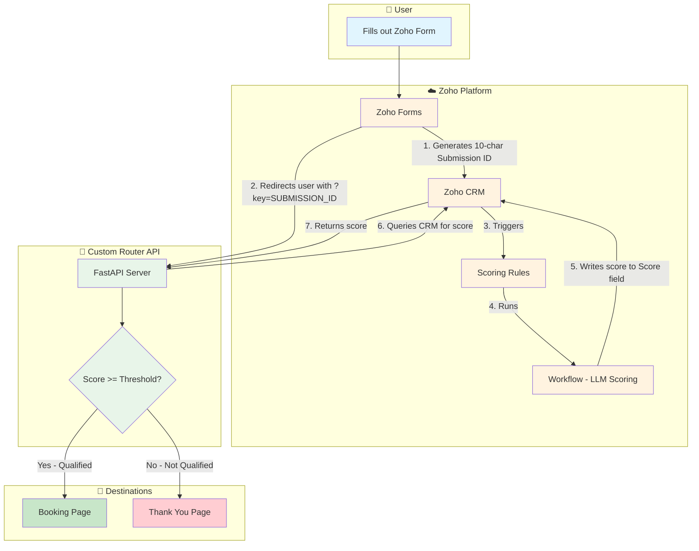

# Application Flow Documentation

## Overview

This system routes applicants to different destinations based on their qualification score, which is calculated by Zoho CRM using AI/LLM scoring.

## Flow Diagram



## Detailed Step-by-Step Flow

### 1. Form Submission
- User fills out the application form on **Zoho Forms**
- Upon submission, Zoho Forms automatically generates a unique **10-character Submission ID** (alphanumeric)

### 2. Data Storage
- Form data is saved to **Zoho CRM** under the `Form_Submissions` custom module
- The Submission ID is stored as a field in the CRM record

### 3. Scoring Process (Background)
- **Zoho Scoring Rules** are triggered on the new record
- A **Zoho Workflow** executes an LLM-based evaluation
- The LLM analyzes the submission and outputs a numeric score
- Score is written to the `Score` field in the CRM record

### 4. User Redirect
- Simultaneously, after form submission, the user is redirected to:
  ```
  https://router.example.com/?key={SUBMISSION_ID}
  ```

### 5. Score Lookup
- The **FastAPI Router** receives the request with the Submission ID
- It queries Zoho CRM API to fetch the record by Submission ID
- Retrieves the `Score` field value

### 6. Routing Decision
- **If Score >= Threshold (default: 70)**
  - User is redirected to the **Booking Page** (e.g., Cal.com, Calendly)
  - These are qualified leads ready for a call

- **If Score < Threshold or Not Found**
  - User is redirected to the **Thank You Page** (LeadPages)
  - Polite rejection without revealing qualification status

## Configuration

| Variable | Description | Example |
|----------|-------------|---------|
| `ZOHO_MODULE_NAME` | CRM module name | `Form_Submissions` |
| `ZOHO_KEY_FIELD` | Field containing Submission ID | `Submission_ID` |
| `ZOHO_SCORE_FIELD` | Field containing the score | `Score` |
| `SCORE_THRESHOLD` | Minimum score to qualify | `70` |
| `SUCCESS_REDIRECT_URL` | Booking page URL | `https://cal.com/company/intro` |
| `THANK_YOU_PAGE_URL` | Rejection page URL | `https://company.leadpages.co/thank-you` |

## Timing Consideration

There's a potential race condition: the user might hit the router before the LLM scoring completes. Current behavior:
- If score is not yet available → redirects to Thank You page

Future enhancement options:
- Add retry/polling logic
- Add a brief delay before querying
- Use webhooks from Zoho when scoring completes

## Architecture

```
┌─────────────────┐     ┌─────────────────┐     ┌─────────────────┐
│   Zoho Forms    │────▶│    Zoho CRM     │◀────│  FastAPI Router │
│                 │     │                 │     │                 │
│ • Collects data │     │ • Stores data   │     │ • Queries score │
│ • Generates ID  │     │ • LLM scoring   │     │ • Routes users  │
│ • Redirects     │     │ • Score storage │     │                 │
└─────────────────┘     └─────────────────┘     └─────────────────┘
        │                                               │
        │                                               ▼
        │                                       ┌───────────────┐
        └──────────────────────────────────────▶│    User's     │
                                                │   Browser     │
                                                └───────┬───────┘
                                                        │
                                          ┌─────────────┴─────────────┐
                                          ▼                           ▼
                                   ┌─────────────┐             ┌─────────────┐
                                   │  Booking    │             │  Thank You  │
                                   │    Page     │             │    Page     │
                                   └─────────────┘             └─────────────┘
```
